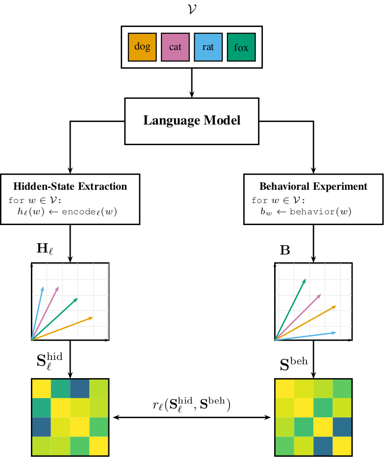
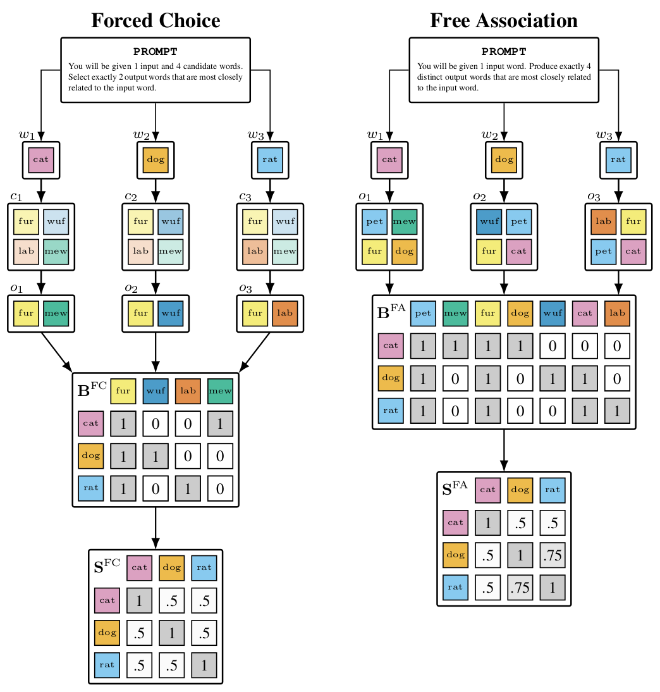
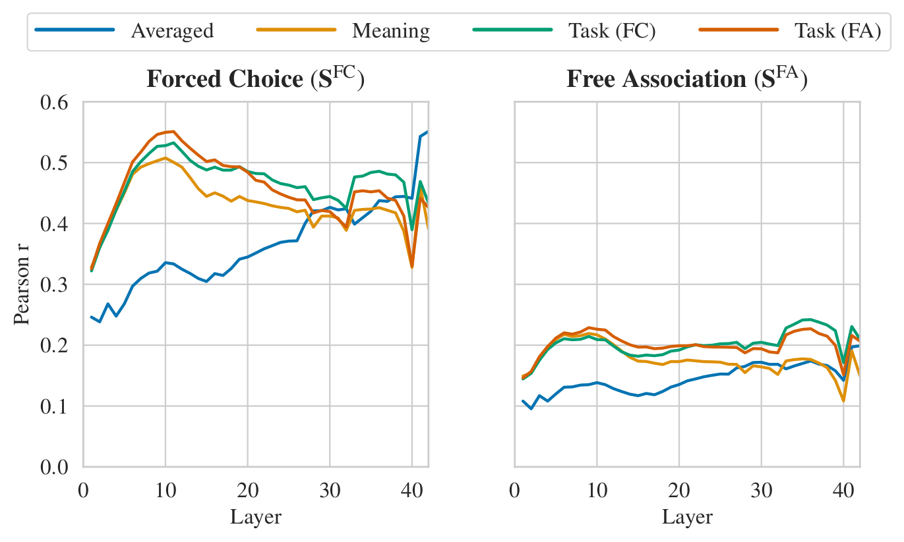

# From Associations to Activations
### Comparing Behavioral and Hidden-State Semantic Geometry in LLMs

> **Accepted at ICML 2026** · [Paper](https://arxiv.org/abs/2602.00628) · [Dataset on Hugging Face](https://huggingface.co/datasets/schiekiera/llm-association-geometry) · [Blog post](https://schiekiera.github.io/blog/2026/neural-semantic-geometry/)

<br>

In cognitive science, semantic knowledge is treated as a latent structure: we cannot observe a speaker's meaning representations directly, but we can probe them through behavior. Word-association paradigms use exactly this logic — when a participant sees a cue (e.g., *dog*), the associations they produce (*cat*, *leash*, *bark*) are constrained by their underlying semantic organization, and aggregated responses yield a similarity matrix that approximates the geometry of an otherwise unobserved system.

We transfer this measurement logic to large language models. Unlike humans, LLMs make *both* behavior and internal representations observable, so we can ask directly: how well does an LLM's behavioral output reveal its own internal semantic geometry?

<p align="center">
  
</p>

**The framework.** Over a shared vocabulary of 5,000 high-frequency English nouns, we (i) extract layer-wise word representations to form hidden-state similarity matrices, and (ii) collect behavioral associations to build behavioral similarity matrices. Representational similarity analysis (RSA) then correlates the two geometries to quantify behavior–activation alignment.

**Two psycholinguistic paradigms.** We probe each model under two classic tasks: **forced choice (FC)**, where the model selects the two most related words from a candidate set of 16, and **free association (FA)**, where the model generates five associates from a single cue. Cue–response counts are reweighted by PPMI, and a cue–cue similarity matrix is derived by cosine similarity. In total, we collected over **17.5 million trials** across eight instruction-tuned transformers (7B–14B params).

<p align="center">
  
</p>

**Key findings.**
- **Forced choice aligns substantially more than free association.** Mean FC RSA reaches *r* = .463 under task-aligned hidden-state extraction, compared to *r* = .199 for FA. The advantage is consistent across all eight models.
- **Behavioral similarity predicts unseen hidden-state structure.** A held-out-words ridge regression shows that adding FC similarity on top of lexical baselines and a cross-model consensus geometry improves test *R*² by +.022, with peak *R*² = .844 for Llama-3.1-8B-Instruct.
- **Measurement protocol matters.** Whether behavior *reveals* internal structure is not a generic property of "behavior" — it depends critically on how responses are constrained and aggregated. Constrained paradigms like FC concentrate observations and yield higher signal-to-noise estimates of semantic geometry.

<p align="center">
  
</p>

For interpretability research, this means behavioral probing can serve as a practical tool for understanding internal representations under black-box access, *if* the probe is designed with sufficient response constraint.

---

## Citation

If you find this work helpful for your research, please cite our paper:

```bibtex
@inproceedings{schiekiera2026associations,
  title={From Associations to Activations: Comparing Behavioral and
         Hidden-State Semantic Geometry in {LLMs}},
  author={Schiekiera, Louis and Zimmer, Max and Roux, Christophe
          and Pokutta, Sebastian and G{\"u}nther, Fritz},
  booktitle={Proceedings of the 43rd International Conference on
             Machine Learning (ICML)},
  year={2026},
  publisher={PMLR},
}
```

---

# Repository contents

This GitHub repository contains code and lightweight data for the paper. The full **behavioral association dataset** is hosted on Hugging Face due to its size:
`https://huggingface.co/datasets/schiekiera/llm-association-geometry`

## What's in this repo vs. on Hugging Face

- **In this GitHub repo**:
  - **Scripts** to reproduce preprocessing, data collection, postprocessing, evaluation, and plotting (`scripts/`).
  - **Input vocabulary files** (`data/vocabulary/`).
  - **Evaluation / analysis outputs** used for figures and tables (`data/eval/`, `data/prediction/`).

- **On Hugging Face (recommended for data access)**:
  - Processed behavioral outputs in **Parquet**:
    - `forced_choice/*.parquet` (1.565M trials/model)
    - `free_association/*.parquet` (≈3.1M rows/model; one row per association)

## Dataset summary (behavioral paradigms)

This project collects association behavior from eight instruction-tuned LLMs under two classic paradigms:

- **Forced choice (FC)**: given a cue word and a candidate set of 16 words, the model selects the **two** most related candidates.
- **Free association (FA)**: given a cue word, the model generates **five** associated words.

These outputs can be aggregated into cue–response count matrices, reweighted (e.g., **PPMI**), and converted into **behavior-derived semantic geometry** (cosine similarity between cue vectors). The paper then compares this behavioral geometry to **hidden-state similarity geometry** via RSA and neighborhood overlap.

## Quickstart: load the behavioral dataset from Hugging Face

### Using Hugging Face Datasets

```python
from datasets import load_dataset

ds_fc = load_dataset(
    "schiekiera/llm-association-geometry",
    data_files="forced_choice/*.parquet",
)

ds_fa = load_dataset(
    "schiekiera/llm-association-geometry",
    data_files="free_association/*.parquet",
)
```

## Next: Use the files on GitHub for preprocessing, evaluation, and plotting


### Repository structure


#### `scripts/`

- **Preprocessing** (`scripts/01_preprocessing/`)
  - `01_process_subtlex.py`: noun filtering, lemmatization, lemma deduplication; writes filtered vocab + 6k stimulus list
  - `02a_extract_sentences_c4.py`: stream C4 and collect sentences per word (supports sharding)
  - `02b_combine_and_filter_shards.py`: combine shard outputs (if used)
  - `03_process_benchmarks.py`: prepare lexical baselines (FastText/BERT)

- **Behavioral data collection** (`scripts/02_get_behavioral_associations/`)
  - `01_forced_choice/`: model-specific forced-choice (FC) collection scripts
  - `02_free_associations/`: model-specific free-association (FA) collection scripts
  - Utilities: `monitor_data_collection_progress.py`, `extract_forced_choice_stats.py`, `analyze_forced_choice_overlap.py`

- **Hidden-state extraction** (`scripts/03_get_hidden_states/`)
  - `get_hidden_states_all_prompts.py`: extract layerwise hidden states under multiple prompting contexts + write cosine similarity matrices

- **Postprocessing** (`scripts/04_postprocessing/`)
  - Forced choice: `01_forced_choice/01_postprocess_forced_choice_all.py`
  - Free association: `02_free_associations/01_postprocess_fa_all.py`
  - Summary stats: `03_counts_matrix_summary_stats.py`

- **Evaluation** (`scripts/05_eval/`)
  - RSA: `01_RSA/01_RSA.py`, `01_RSA/02_RSA_eval.py`
  - NN overlap: `05_NN_centered/01_NN.py`, `05_NN_centered/02_NN_eval.py`
  - SVD variants: `06_SVD_variants/01_compare_SVD_variants.py`

- **Prediction** (`scripts/06_predict/`)
  - Held-out words: `01_held_out_words/01_predict_held-out_words.py`, `01_held_out_words/02_analyze_predictions_held-out_words.py`
  - Ablations: `02_held-out_words_ablation/01_predict_held-out_words_ablation.py`, `02_held-out_words_ablation/02_analyze_predictions_held-out_words_ablation.py`

- **Plots** (`scripts/07_plots/`)
  - Evaluation plots: `01_eval/`
  - Prediction plots: `02_prediction/`
  - Prediction ablation plots: `03_prediction_ablation/`

- **Shell / HPC runners** (`scripts/98_sh_files/`)
  - Convenience run scripts (e.g., SLURM/HPC)


#### `data/`

- **Vocabulary**
  - `data/vocabulary/03_stimulus_list/subtlex_stimuli_6k.csv`: top-6k nouns by SUBTLEX frequency (after filtering/lemmatization)
  - `data/vocabulary/03_stimulus_list/subtlex_stimuli_5k_final.csv`: final 5k noun vocabulary used throughout experiments

- **Results (cached CSVs used in figures/tables)**
  - **RSA (evaluation)**
    - Per model × strategy: `data/eval/01_RSA/<model>/<strategy>/layerwise_correlations_pairs500000_<YYYYMMDD>.csv`
    - All-model summary: `data/eval/01_RSA/summary_all_results_pairs500000_<YYYYMMDD>.csv`
    - Strategies in this repo: `averaged`, `template`, `forced_choice`, `free_association`
  - **NN@k (evaluation)**
    - Per model × strategy × k: `data/eval/02_NN/<model>/<strategy>/layerwise_neighbors_k<k>_<YYYYMMDD>.csv` (k ∈ {5, 10, 20, 50, 100, 200})
    - Cross-model summaries (per k): `data/eval/02_NN/summary_all_neighbors_k<k>_<YYYYMMDD>.csv`
    - Convenience summaries:
      - `data/eval/02_NN/summary_nn_best_k_<YYYYMMDD>.csv`
      - `data/eval/02_NN/summary_nn_per_k_<YYYYMMDD>.csv`
  - **Held-out-words ridge regression (prediction)**
    - Main (mean-centered cosine):
      - Per model × strategy: `data/prediction/01_held_out_words/<model>/<strategy>/ridge_predict_held_out_words_cosine_centered_<timestamp>.csv`
      - Summary: `data/prediction/01_held_out_words/01_summary/summary_prediction_analysis_<timestamp>.csv`
    - Ablation (non-mean-centered cosine):
      - Per model × strategy: `data/prediction/02_held_out_words_ablation/<model>/<strategy>/ridge_predict_held_out_words_cosine_<timestamp>.csv`
      - Summary: `data/prediction/02_held_out_words_ablation/01_summary/summary_prediction_analysis_<timestamp>.csv`
